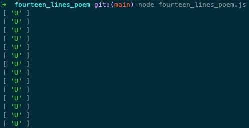

# fourteen_lines_poem
有亿点点小秘密的十四行情诗


### Run
```javascript
node fourteen_lines_poem.js
```


### Result
After pray to God, my world will always be U and only U.




### Explain
尝试翻译成文字，应该是这样：

```
我用一生向上天祈祷，
我愿，
于千万人中，
你来到我的世界。
终于，
我的诚意感天动地。
于是，
你出现了，
在我的世界，
这一生， 
你永远都在， 
而且， 
我的世界，
只有你！
```
